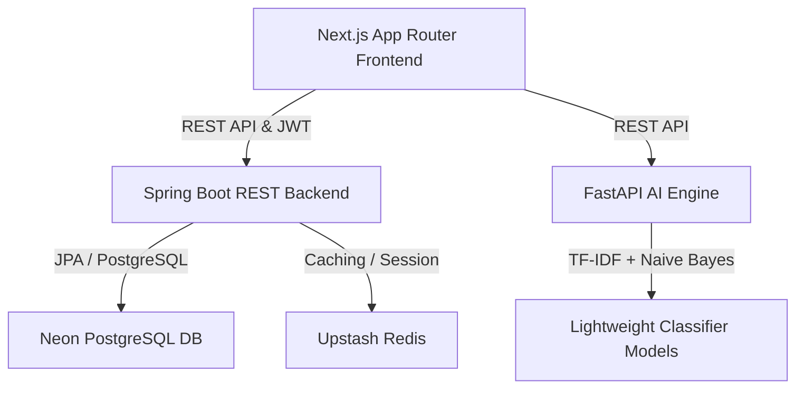

# HOSTELIQ Presentation Outline (4 Slides)

---

## SLIDE 1: THE PROBLEM
### "Choked Operations, Fragmented Communication"

1. **Manual Inefficiencies**: Hostel management is plagued by paper-based approvals for leaves, manual room allotments, and physical registry logs.
2. **Disjointed Portals**: Students, parents, wardens, and security guards operate in silos, causing delays and security vulnerabilities.
3. **Complaint Fatigue**: Wardens spend hours sorting incoming complaints (plumbing, electrical, mess) without clear priority or ETAs.
4. **Lack of Live Analytics**: Zero visibility into real-time hostel occupancy, mess crowds, and outstanding fee collection.

---

## SLIDE 2: THE SOLUTION
### "A Unified AI-Driven Smart Hostel Operating System"

1. **Centralized Hub**: A responsive dashboard tailored for Students, Wardens, Security, and Parents.
2. **TF-IDF AI Complaint Classifier**: Automatically processes unstructured complaints, assigns categories (electrical, water, mess), predicts ETAs, and routes tickets.
3. **Cryptographic Gate Pass System**: Auto-generates QR-code gate passes upon warden leave approval. Guards scan to log check-outs and returns instantly.
4. **Mock Payment Integration**: Quick UPI/Card billing sandbox with real-time receipt generation and outstanding billing reminders.
5. **Mess Density Forecast**: Real-time AI alerts indicating crowd metrics to minimize student queue times.

---

## SLIDE 3: SYSTEM ARCHITECTURE
### "Modern, Scalable & Highly Responsive Tech Stack"

* **Frontend**: Next.js 14, TypeScript, Tailwind CSS, Recharts, Framer Motion (for premium UI animations).
* **Backend**: Spring Boot 3.2, Java 21, Spring Security (JWT), Spring Data JPA, Hibernate, Redis cache.
* **AI Service**: FastAPI, Python 3.10, Scikit-Learn (TF-IDF Vectorizer + Naive Bayes Classifier).
* **Database**: PostgreSQL (Neon Serverless/Local Docker).

---

## SLIDE 4: FUTURE SCOPE
### "Scaling Beyond the Hackathon"

1. **Biometric Integration**: Linking facial recognition and fingerprint scanners at hostel gates directly to the Gate Pass database.
2. **Predictive Maintenance**: Using IoT sensors on water tanks, geysers, and electrical transformers to predict failures before they happen.
3. **Smart Mess Diet Planner**: Implementing LLM-based nutrition tracking and diet plans based on weekly mess menus.
4. **Automated Parent Alerts**: Direct SMS/WhatsApp API integrations to notify parents when a student leaves or enters the campus gate.
